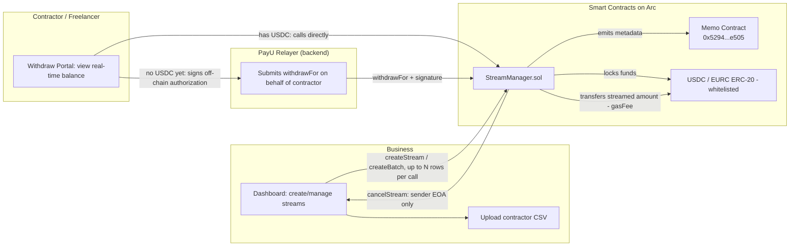

# PayU — Programmable Contractor Payment Streaming on Arc

* **Live Demo:** [getpayu.vercel.app](https://getpayu.vercel.app)
* **GitHub Repository:** [github.com/manhtd2/payU](https://github.com/manhtd2/payU)

> Pay contractors/freelancers by the second, withdraw anytime, near-zero fees — only possible because Arc uses USDC as gas with stable fees and sub-second finality.

---

## 1. Scope & Positioning

**PayU is a B2B payment tool for contractors/freelancers, not a formal employee payroll system.**

On-chain salary payments to formal employees can touch labor law and personal income tax obligations in many jurisdictions (tax withholding, social insurance, etc.) — out of scope for a hackathon product. That's why PayU positions itself clearly:

- **Payer**: a business/startup (typically a Web3 company) that needs to pay its remote team on a recurring basis.
- **Payee**: an independent contractor/freelancer, paid in USDC under a service agreement (not an employment relationship).
- All documentation, UI, and the demo video use the term **"contractor payment"**, avoiding "salary/employee payroll" wording to prevent misunderstanding about legal obligations.

## 2. Problem

Recurring payments to contractors — even on-chain ones — are usually paid in batches (end of week, end of month):

- Contractors must wait until a fixed payday to get paid, even though the work was completed day by day.
- Businesses keep the entire budget "dead" in a wallet until close to the deadline, failing to optimize cash flow.
- Existing streaming payment solutions (Sablier, Superfluid, etc.) run on chains where gas fees fluctuate, making small, high-frequency withdrawals (hourly, daily) uneconomical — fees eat up the withdrawn amount.

## 3. Solution

**PayU** is a programmable treasury that lets a business open a USDC "stream" to each contractor, flowing every second at a configured rate. Contractors can withdraw the "streamed" portion at any time — even multiple times a day — without fees eating into it, because:

- **Arc's gas fee is stable and denominated in USDC** (not subject to native token price swings) → businesses and contractors know exactly what each withdrawal costs.
- **Sub-second settlement** → withdrawals are instant, with no need to wait for multiple block confirmations like on other chains.

This is precisely the condition that makes streaming payments economically viable for the first time for micro, high-frequency withdrawals — something the old model on Ethereum L1 could never achieve, since gas fees would exceed the withdrawn value.

## 4. Why Arc (and not another chain)

| Arc characteristic | Role in PayU |
| --- | --- |
| USDC-denominated gas, stable fees (EWMA smoothing) | Businesses estimate operating costs precisely in USD, without worrying about gas token price swings |
| Deterministic sub-second finality | Contractors withdraw and see their balance update immediately, without waiting for reorgs |
| Multi-stablecoin (USDC + EURC) | Extend payments to Eurozone contractors in EURC via App Kit Swap, separate from the core USDC treasury |
| Built-in Memo contract | Attach metadata (payment period, contract ID, invoice ID) to every withdrawal transaction, supporting accounting reconciliation without custom infrastructure |
| Standard EVM compatibility | Reuse the Solidity/Foundry/viem toolchain as-is, no relearning required |

## 5. Core features (MVP)

- [ ] **Create stream**: The business locks a USDC amount into the contract, specifying the recipient, total amount, and start/end time → the system automatically computes `ratePerSecond`.
- [ ] **Flexible withdrawal**: The contractor sees the "streamed but not yet withdrawn" balance in real time, and can withdraw part or all of it at any time.
- [ ] **Gasless withdrawal (no USDC required upfront)**: The contractor signs an off-chain authorization, PayU's relayer submits the transaction on their behalf, and the gas fee is deducted directly from the withdrawal.
- [ ] **Batch payment**: Create multiple streams at once from a CSV file listing contractors (wallet address, amount, period), with a row limit per batch to avoid exceeding the block gas limit.
- [ ] **Cancel/pause stream**: The business can cancel a stream (e.g., when ending a contract) — the streamed portion belongs to the contractor, the unstreamed portion returns to the treasury.
- [ ] **Attached memo**: Each withdrawal carries a memo (payment period, contract ID) via Arc's Memo contract.
- [ ] **(Extension) Pay in EURC**: Configure a stream to pay in EURC, automatically swapped from the USDC treasury via App Kit Swap at stream creation time.

**Out of MVP scope** (decided to keep scope contained):
- No email/notification reminders to withdraw — contractors proactively check the dashboard themselves.
- No multisig support for the payer (sender) — only a single EOA wallet represents the business.
- No automatic treasury pool rebalancing — each stream locks its own portion of funds (see section 9).

## 6. Architecture



**Frontend**: Next.js + wagmi/viem + RainbowKit (wallet connection) + App Kit SDK (USDC↔EURC swap).
**Backend/on-chain**: Solidity (Foundry), deployed on Arc Testnet. A lightweight backend acts as the relayer for gasless withdrawals.
**Indexer**: tracks `StreamCreated`, `Withdrawn`, `StreamCancelled` events to display real-time data on the dashboard.

## 7. Smart contract design

### `StreamManager.sol`

```solidity
struct Stream {
    address sender;        // business (1 EOA — no multisig support in MVP)
    address recipient;     // contractor/freelancer
    address token;         // must be in allowedTokens
    uint256 totalAmount;
    uint256 ratePerSecond;
    uint256 startTime;
    uint256 stopTime;      // = startTime + duration, or the time it was cancelled
    uint256 withdrawn;
    uint256 nonce;          // replay protection for withdrawFor
    bool    cancelled;
}

uint256 public constant MAX_BATCH_SIZE = 50;   // limit on the number of streams created per transaction
uint256 public constant MAX_GAS_FEE = 0.05e6;  // cap on the gas fee the relayer can deduct (0.05 USDC), preventing relayer overcharging

mapping(address => bool) public allowedTokens; // set at deploy time: USDC, EURC — arbitrary tokens not accepted

function createStream(address recipient, address token, uint256 totalAmount, uint256 startTime, uint256 duration) external returns (uint256 streamId);
function createBatch(StreamParams[] calldata streams) external; // reverts if streams.length > MAX_BATCH_SIZE
function balanceOf(uint256 streamId) public view returns (uint256 withdrawable);

// Contractor calls this themselves, paying gas with USDC already in their wallet
function withdraw(uint256 streamId, uint256 amount, bytes calldata memo) external;

// Gasless: PayU's relayer calls this on behalf of the contractor. The gas fee is deducted
// directly from the withdrawal, so the contractor doesn't need to hold USDC to pay gas for their first withdrawal.
function withdrawFor(
    uint256 streamId,
    uint256 amount,
    uint256 gasFee,           // <= MAX_GAS_FEE, configured based on Arc's average ERC-20 transfer fee (~0.001 USDC + margin)
    bytes calldata memo,
    bytes calldata signature  // EIP-712, recipient signs off-chain authorizing exactly this streamId + amount + nonce
) external;

function cancelStream(uint256 streamId) external; // only callable by sender (1 EOA) — no multisig support in the MVP
```

**Available balance formula:**

```
elapsed         = min(now, stopTime) - startTime
streamed        = elapsed * ratePerSecond
withdrawable    = streamed - withdrawn
```

**Gasless withdrawal mechanism (`withdrawFor`):**

1. The contractor signs an off-chain EIP-712 message (free, no USDC required) authorizing: "allow withdrawing `amount` from `streamId`, pay `gasFee` to the relayer, using this `nonce`."
2. The relayer (PayU backend) submits the `withdrawFor` transaction on Arc, paying the gas itself.
3. The contract verifies the signature matches `recipient`, verifies the `nonce` hasn't been used, and verifies `gasFee <= MAX_GAS_FEE`.
4. The contract transfers `gasFee` to the relayer (`msg.sender`), transfers `amount - gasFee` to the contractor, and increments `nonce` by 1 to prevent replay.

### Security considerations

- **Reentrancy**: use `nonReentrant` + checks-effects-interactions for `withdraw`/`withdrawFor`.
- **Access control**: only `recipient` (via a valid signature) can withdraw, only `sender` (1 EOA) can cancel — this limitation is clearly stated in the demo; multisig support is not claimed in the MVP.
- **Signature replay protection**: `nonce` increments per stream; the contract rejects an already-used `nonce`.
- **Relayer fee cap**: `gasFee <= MAX_GAS_FEE` so the relayer cannot deduct an arbitrary amount.
- **Token whitelist**: `allowedTokens[token]` must be `true` for `createStream` to succeed — blocks fake tokens/fee-on-transfer tokens from breaking internal accounting.
- **Arithmetic rounding**: use integers (uint256, USDC's 6 decimals), avoid dividing before multiplying to prevent losing small balances.
- **Mid-stream cancellation**: `streamed` must be locked in at the moment of cancellation before setting `stopTime = now`, ensuring the streamed portion is never lost even if the stream is cancelled immediately after.
- **Batch size**: `createBatch` reverts if it exceeds `MAX_BATCH_SIZE` — the frontend automatically chunks large CSVs into multiple sequential transactions.

## 8. User flows

**Business creates a payment batch:**
1. Connect wallet (RainbowKit) → deposit USDC into the treasury.
2. Upload a CSV (wallet address, amount, start date) or create a single stream. CSVs with more than 50 rows are automatically split into multiple transactions.
3. Confirm the `createBatch` transaction → each contractor gets their own stream.

**Contractor withdraws payment:**
- *Already has USDC for gas*: Connect wallet → view the "Available balance" dashboard updating in real time (computed client-side from `ratePerSecond`, accepting a few seconds of drift due to system clock differences) → tap "Withdraw" → call `withdraw` directly.
- *First time, no USDC yet*: Tap "Withdraw" → sign an EIP-712 message (free) → PayU's relayer submits `withdrawFor` on their behalf → receives `amount - gasFee` in under 1 second.

**Business ends a contract:**
1. Call `cancelStream` (only callable by the original sender wallet) → the streamed portion is locked for the contractor to withdraw, the remainder returns to the treasury immediately.

## 9. Finalized design decisions

| Issue | Decision | Trade-off accepted |
| --- | --- | --- |
| Lock funds per stream or in a shared pool | **Each stream locks its own funds** | Simpler, safer, easier to audit — trades off flexibility compared to a shared pool (can't withdraw uncommitted budget) |
| Does the payer (sender) need multisig | **No — just 1 EOA per treasury stream** | Sufficient for the hackathon demo; multisig is a later roadmap item |
| Real-time balance sync in the UI | **Computed client-side, accepting a few seconds of drift** | Avoids constant RPC polling; doesn't affect actual on-chain figures at withdrawal time |
| Batch limit | **Max 50 rows per transaction** | Avoids exceeding the block gas limit; larger CSVs are automatically split into multiple txs |
| Withdrawal reminders | **No notifications in the MVP** | Reduces scope — contractors proactively check the dashboard |
| Legal positioning | **"B2B contractor/freelancer payment", not "employee payroll"** | Avoids the labor law/tax gray area — see section 1 |

## 10. Folder structure (proposed)

```
payroll-streaming/
├── contracts/              # Foundry project
│   ├── src/StreamManager.sol
│   ├── test/StreamManager.t.sol
│   └── script/Deploy.s.sol
├── relayer/                 # small backend that submits withdrawFor on behalf of contractors
│   └── src/index.ts
├── app/                     # Next.js frontend
│   ├── app/dashboard/        # business page
│   ├── app/withdraw/         # contractor page
│   └── components/
├── docs/
│   └── demo-script.md
└── README.md
```

## 11. Getting started (planned)

```bash
# Contracts
cd contracts
forge install
forge test
forge script script/Deploy.s.sol --rpc-url https://rpc.testnet.arc.network --account <keystore-name> --sender <deployer-address> --broadcast

# Frontend
cd app
npm install
npm run dev
```

Required environment variables:

```
NEXT_PUBLIC_ARC_RPC_URL=https://rpc.testnet.arc.network
NEXT_PUBLIC_ARC_CHAIN_ID=5042002
NEXT_PUBLIC_STREAM_MANAGER_ADDRESS=<address after deployment>
NEXT_PUBLIC_USDC_ADDRESS=0x3600000000000000000000000000000000000000
NEXT_PUBLIC_EURC_ADDRESS=0x89B50855Aa3bE2F677cD6303Cec089B5F319D72a
```

Get testnet USDC/EURC from the [Circle Faucet](https://faucet.circle.com/) (select the **Arc Testnet** network).

## 12. Demo script (persona)

A small Web3 startup (e.g., a 5-person dev shop) pays weekly compensation to 3 remote contractors (frontend dev, designer, content writer) in USDC. The 3-minute demo video should follow this exact story:

1. The founder creates 3 streams for 3 contractors via CSV upload (10 seconds).
2. One contractor opens the dashboard, sees the balance running in real time, and withdraws mid-week (no need to wait until the weekend).
3. The founder cancels the contract with one contractor mid-stream → demonstrating that the streamed portion can still be withdrawn, while the remainder returns to the treasury immediately.

## 13. Roadmap by hackathon milestones

- **Checkpoint 3 — Final submission (Aug 9)**: Working MVP on Arc Testnet — single + batch stream creation, real-time withdrawal (both flows: self-paid gas and gasless via relayer), stream cancellation, 3-minute demo video following the script in section 12.
- **After the hackathon (if selected for the accelerator)**: automatic EURC swap integration, compliance hooks (Elliptic/TRM) for large enterprise clients, multisig for the sender, mainnet launch.

## 14. Open risks

- USDC↔EURC swap liquidity on testnet may be unstable — need a clear fallback/logging mechanism during the demo.
- Not yet handling the case where the treasury runs out of funds mid-way while multiple streams are being withdrawn from (need to check balance before allowing new stream creation).
- The relayer is a centralized point — if it goes down, contractors without USDC will temporarily be unable to withdraw gaslessly; need a fallback guiding contractors to deposit a minimum amount of USDC to withdraw directly.

## 15. License

MIT

